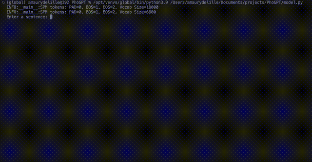

# PhoGPT
English-Vietnamese translator made from a boring afternoon, but since it looked cool I thought I would push it.

Very simple Transformer [(Vaswani and Al, 2017)](https://arxiv.org/abs/1706.03762) of 100M parameters, trained on 3M pairs of sentences.

Please find the weights on the associated [HuggingFace repo](https://huggingface.co/amaury-delille/PhoGPT-20M).

## Demo

